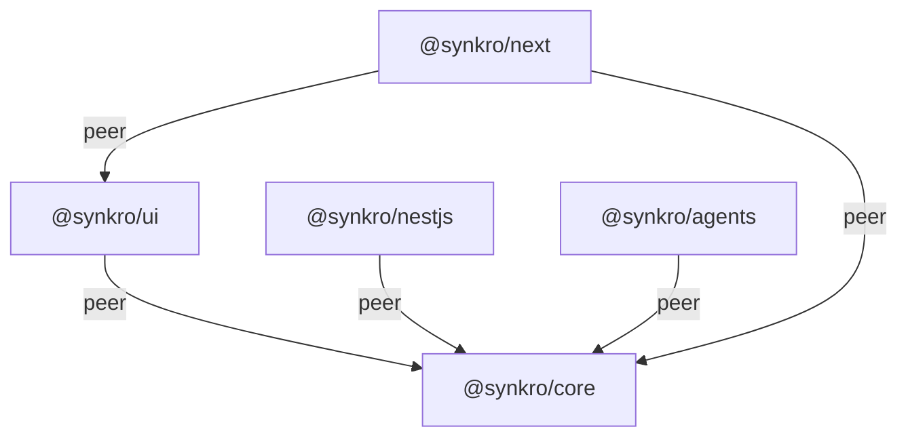

import { Aside } from '@astrojs/starlight/components';

## Overview

Synkro is organized as a monorepo with five packages. `@synkro/core` is the foundation -- every other package depends on it as a peer dependency.

## Dependency graph



## Package roles

| Package | Version | Purpose |
|---|---|---|
| `@synkro/core` | 0.18.0 | Event engine, workflow runner, state machine, transports (in-memory and Redis) |
| `@synkro/ui` | 0.2.2 | Web dashboard for visualizing events, workflows, and metrics |
| `@synkro/nestjs` | 0.5.1 | NestJS module with decorators, DI, and async configuration |
| `@synkro/next` | 0.2.1 | Next.js integration with route handlers and serverless support |
| `@synkro/agents` | 0.1.0 | AI agent orchestration with tools, memory, and multi-agent delegation |

## Why peer dependencies?

All integration packages declare `@synkro/core` as a **peer dependency** rather than a direct dependency. This design gives you three benefits:

1. **Single instance** -- Your application always has exactly one copy of `@synkro/core` in the dependency tree. There is no risk of version conflicts or duplicate state.

2. **Install only what you need** -- If you only use NestJS, install `@synkro/core` and `@synkro/nestjs`. The other packages are not pulled in.

3. **Version control** -- You decide which version of core to use. Integration packages specify a compatible range (e.g., `@synkro/core ^0.15.0`) so you can upgrade core independently.

### The @synkro/next special case

`@synkro/next` has peer dependencies on **both** `@synkro/core` and `@synkro/ui`, since it serves the dashboard through Next.js route handlers. When using this package, install all three:

```bash
npm install @synkro/core @synkro/ui @synkro/next
```

## Minimal install examples

<Aside type="tip">
  Each example assumes you have already installed `@synkro/core`.
</Aside>

**Standalone Node.js with dashboard:**
```bash
npm install @synkro/core @synkro/ui
```

**NestJS application:**
```bash
npm install @synkro/core @synkro/nestjs
```

**Next.js application with dashboard:**
```bash
npm install @synkro/core @synkro/ui @synkro/next
```

**AI agent orchestration:**
```bash
npm install @synkro/core @synkro/agents
```
